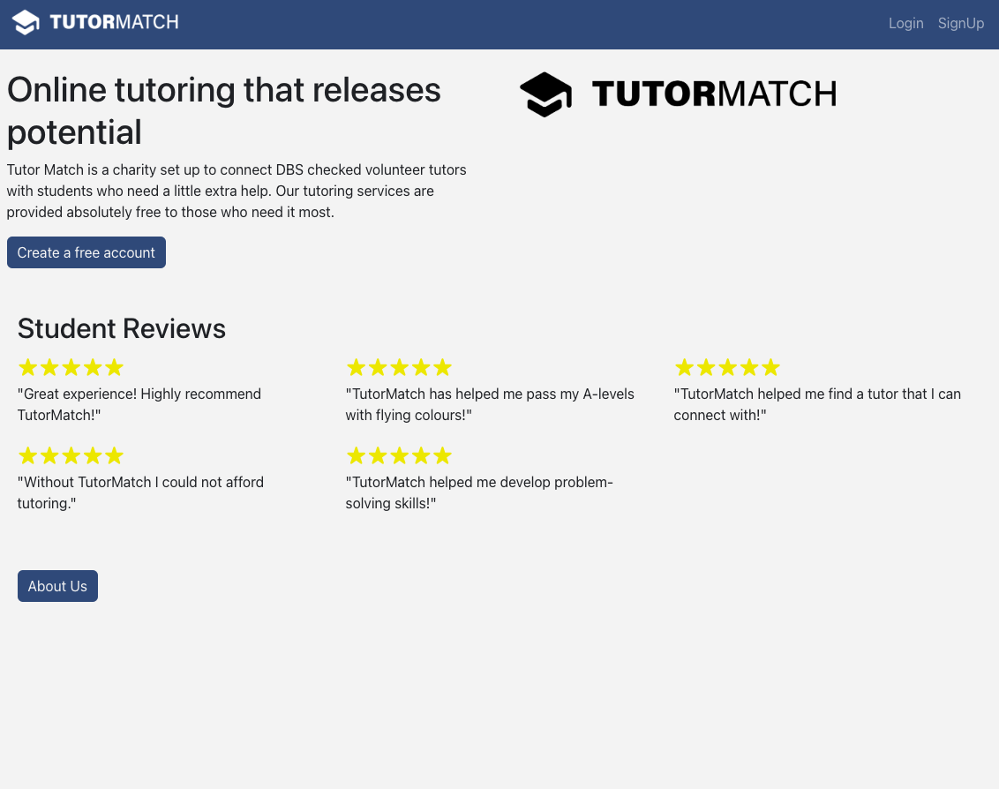
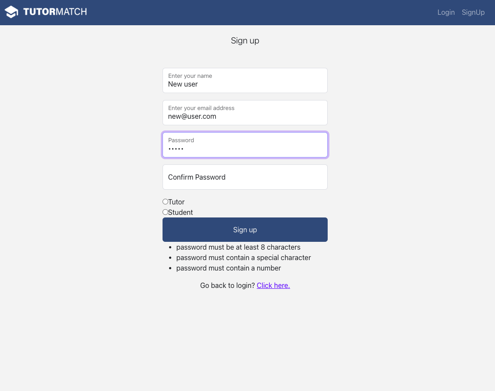
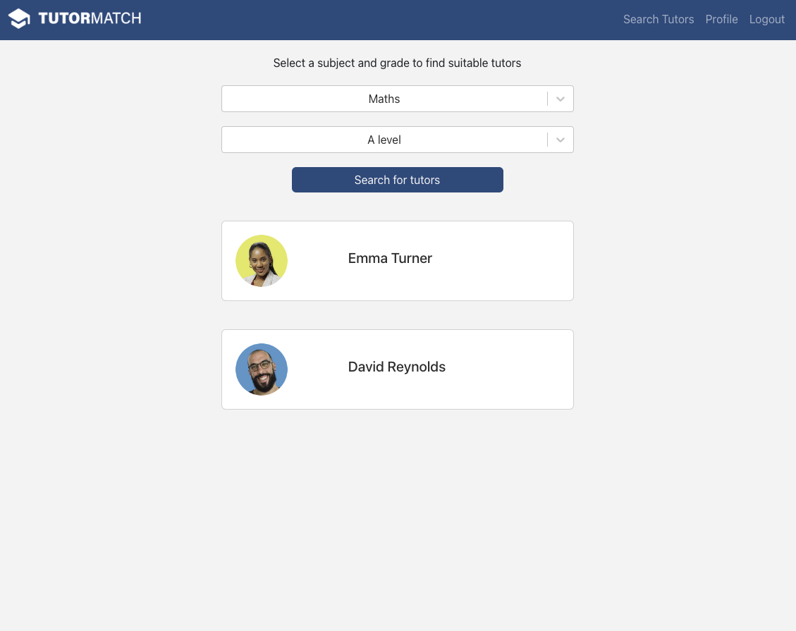
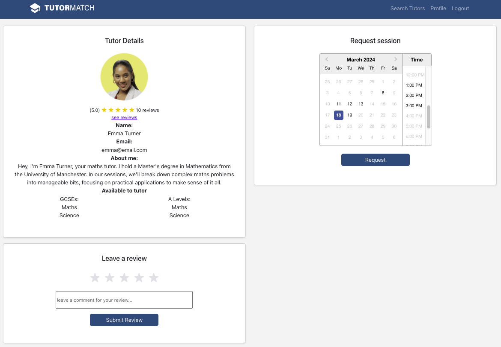
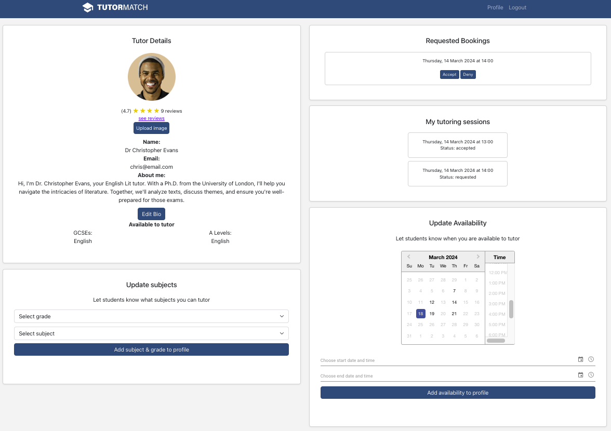
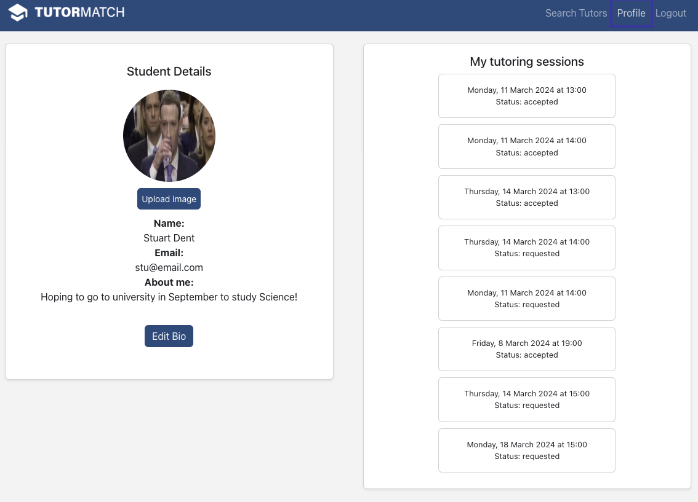

# TutorMatch - a Makers Academy final project
TutorMatch was a final project for the Makers Academy software engineering specialist track. The website was planned, designed and built in two weeks by a team of five junior software engineers and two junior quality engineers. The team was self-guided, choosing what to develop and using professional software development techniques to achieve the MVP.

As of the end of the project, TutorMatch has the following functionality:
- Volunteer tutors and students can sign up
- Users can add profile pictures and an 'about me' section
- New volunteers must be approved by admin accounts
- Tutors can add subjects and grade to their profile
- Tutors can add their availability
- Students can request availabile slots with tutors
- Tutoring requests can be confirmed or rejected by tutors
- Students can leave reviews for tutors
- Requested and booked sessions are displayed on users' profiles
- Users recieve emails when signing up and when tutoring sessions are requested or booked

## Tech stack

 
 
 	
 

## Team
- [Ann Galloway](https://github.com/AnnGalloway)
- [Dan Gullis](https://github.com/dgullis)
- [Kat Bielecka](https://github.com/KatBiel)
- [Leah Simon](https://github.com/nsleeah)
- [Muhtadi Maahir](https://github.com/MMaahir)
- [Pier Bruno Pompili](https://github.com/PierPompilii)
- [Simon Budden](https://github.com/fantastito)

# Objectives
We used our final project as an opportunity to showcase, and build on, everything that we had learnt during the four-month course. 

Technology-wise, this meant using Python and Javascript in combination, which we hadn't yet encountered, and integrating new tools such as Firebase and Bootstrap. 

In terms of management, we practised the professional methodologies that we leant during the course to develop our idea and achieve our MVP and then go further than previous projects, adding extra features, setting up CI/CD and running the project on a cloud service.

# Project idea
Our team was given the theme 'tech for good' for the project, which we developed into the idea of helping people from disadvantaged backgrounds. Tutoring can have profound impact on young people's lives so we decided to develop a website that connects volunteer tutors with students who require a little extra help. We found this idea attractive beacuse it was scalable. As an MVP, the idea had could be a simple tutor directory but had scope for expansion into a feature-rich interactive web application.

# Development process
We began by planning the product, using a [Miro board](https://miro.com/app/board/uXjVNoChLNw=/) to centralise elements, such brainstorming user interactions, identifying an MVP, planing development of further stages, and designing the use cases and database. We considered all aspects of the app's use cases, from secure sign-up and log-in to the need for safeguarding mechanisms for working with a young target audience.

We also planned our workflow, using a [Trello board](https://trello.com/b/Sea5ymWg/tutormatch) to allocate our work, and the agile methodolgy to create two-day sprints with daily meetings - morning stand-ups, afternoon catch-ups and evening retros - that fostered communication and allowed us to rapidly prioritise, share and review work.

The lack of resources for our FReMP-stack proved challenging and required innovation to identify relevant resources. We also encountered a security breach that we resolved together. As a result, we strengthened our security protocols and enhanced our understanding of potential vulnerabilities and security measures, as well as giving us a heightened sense of vigilance to safeguarding our systems and data.

Ultimately, we achieved our objectives, creating a working web app and growing as software developers.

# Screenshots
As of the end of the project, [TutorMatch](https://tutormatchfe.onrender.com/) is live. These screenshots demonstrate the pages and functionality for different users.
<table>
  <tr>
    <td></td>
    <td></td>
  </tr>
  <tr>
    <td></td>
    <td></td>
  </tr>
   <tr>
    <td></td>
    <td></td>
  </tr>
</table>

# Quick start
Clone the repo to your local machine and run the follling set up from the CLI in the front- and backend folder:

## Frontend:
1. Install node: brew install node
2. Install dependencies:
   1. npm install react-router-dom
   2. npm install -g create-react-app
   3. npm install bootstrap
   4. npm install firebase
   5. npm install react-bootstrap
   6. npm install flask
   7. npm install react-select
   8. npm install @syncfusion/ej2-react-calendars @syncfusion/ej2-base @syncfusion/ej2-data
   9. npm install react-datepicker
   10. npm install --save-dev @vitejs/plugin-react-swc
   11. npm install jsdom --save-dev
4. Run the frontend server: npm start

## Backend:
1. Install dependencies:
   1. pip install pipenv
   2. pipenv install
   3. pipenv shell
   4. pipenv install flask pymongo
   5. pip install pytest
   6. pip install python-dotenv
   7. pip install firebase-admin
   8. pip install flask-cors
   9. pip install Flask-Mail
2. Run the backend server: pipenv shell python app.py

If Mongodb is running locally:
1. brew tap mongodb/brew
2. brew install mongodb-community@6.0
3. brew services start mongodb-community@6.0